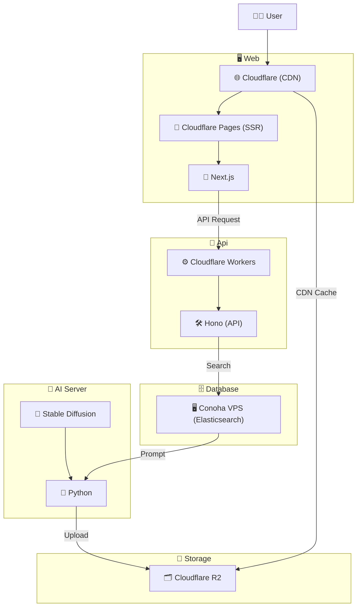

<h1 align="center">

 
Let AI Handle Your Look!(外見なんか AI に任せとけ)
</h1>

 

Stable Diffusion で作ったストリートスナップを見て楽しむファッションコーディネートサイト

## アーキテクチャ

- フロントエンド

  - Cloudflare Pages(SSR)
  - Next.js

- バックエンド

  - Cloudflare Workers
  - Hono

- DB

  - Elasticsearch
  - Conoha VPS

- ストレージ

  - Cloudflare R2

- CDN

  - Cloudflare

- AI
  - Stable Diffusion(Realistic_Vision_V5)
  - Python
