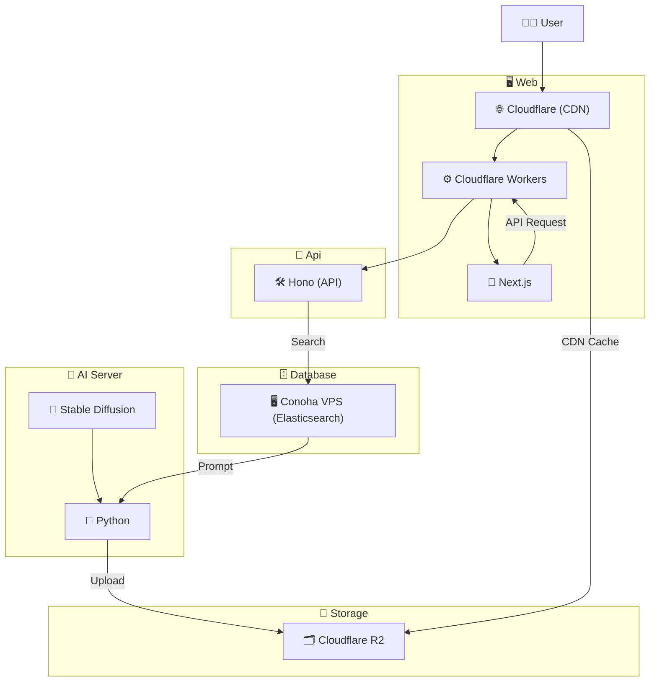

<h1 align="center">

 
Let AI Handle Your Look!(外見なんか AI に任せとけ)
</h1>

 

Stable Diffusion で作ったストリートスナップを見て楽しむファッションコーディネートサイト

## 特徴

- **運用要らず 😴** 毎日自動で 20〜30 種類※のコーディネイトが追加される
- **探したいものがすぐ見つかる 🔍** 画像生成に使用したプロンプトの内容を日本語でそのまま検索できる
  _（例：夏ファッション / T シャツ / ハーフパンツ など）_
- **検索が爆速 ⚡️** 高速検索エンジン Elasticsearch を使用しており、ストレスフリーな体験
- **安心・安全な画像利用 🔓** 生成された画像は 商用利用可 / 著作権問題なし

※ 最弱マシンの場合

## アーキテクチャ

- フロントエンド

  - Cloudflare Workers(SSR)
  - Next.js

- バックエンド

  - Cloudflare Workers
  - Hono

- DB

  - Elasticsearch
  - Conoha VPS

- ストレージ

  - Cloudflare R2

- CDN

  - Cloudflare

- AI
  - Stable Diffusion(Realistic_Vision_V5)
  - Python
