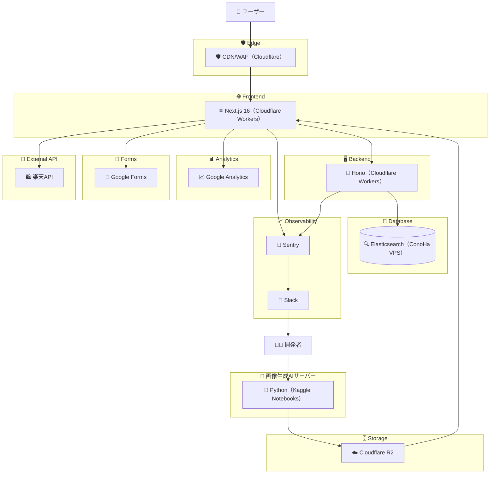

<h1 align="center">

 
Let AI Handle Your Look!(外見なんか AI に任せとけ)
</h1>

 

生成AI で作ったストリートスナップを見て楽しむファッションコーディネートサイト

## 特徴

- **運用最小限 😴** 毎日自動で 40 種類以上※のコーディネイトが追加される
- **探したいものがすぐ見つかる 🔍** 画像生成に使用したプロンプトの内容を日本語でそのまま検索できる
  _（例：夏ファッション / T シャツ / ハーフパンツ など）_
- **検索が爆速 ⚡️** 高速検索エンジン Elasticsearch を使用しており、ストレスフリーな体験
- **安心・安全な画像利用 🔓** 生成された画像は 商用利用可 / 著作権問題なし
- **エラーハンドリング 🛠️** Sentry で例外を監視・通知

## アーキテクチャ

- **Frontend**: Next.js 16（Cloudflare Workers）
- **CDN/WAF**: Cloudflare
- **Backend**: Hono（Cloudflare Workers）
- **Database**: Elasticsearch（ConoHa VPS）
- **AI Server**: Python + FLUX（Kaggle Notebooks）
- **Storage**: Cloudflare R2
- **Observability**: Sentry → Slack
- **Analytics/Forms**: Google Analytics / Google Forms
- **External API**: 楽天API

ユーザーは Cloudflare の CDN/WAF 経由で Frontend にアクセスし、Frontend から Backend・各種外部サービス（Analytics/Forms/楽天API）へ接続します。Backend は DB と Sentry に連携し、Sentry の通知は Slack 経由で開発者に届きます。画像生成は開発者が AI サーバーを実行して行い、生成結果は R2 に保存され Frontend から配信されます。
