<h1 align="center">

 
Let AI Handle Your Look!(外見なんか AI に任せとけ)
</h1>

 

Stable Diffusion で作ったストリートスナップを見て楽しむファッションコーディネートサイト

## アーキテクチャ

```mermaid
graph TD

  %% ==== User ====
  User["🧑‍💻 User"]
  User --> CF

  %% ==== Frontend ====
  subgraph "🖥️ Web"
    CF["🌐 Cloudflare (CDN)"]
    Pages["📄 Cloudflare Pages (SSR)"]
    Framework["🧱 Next.js"]
    CF --> Pages
    Pages --> Framework
  end

  %% ==== Backend ====
  subgraph "🔧 Api"
    Workers["⚙️ Cloudflare Workers"]
    Hono["🛠️ Hono (API)"]
    Framework -->|API Request| Workers
    Workers --> Hono
  end

  %% ==== DB ====
  subgraph "🗄️ Database"
    ESNode["🖥️ Conoha VPS (Elasticsearch)"]
  end

  Hono -->|"Search"| ESNode

  %% ==== Storage ====
  subgraph "💾 Storage"
    R2["🗂️ Cloudflare R2"]
  end

  %% ==== AI ====
  subgraph "🧠 AI Server"
    SD["🎨 Stable Diffusion"]
    Python["🐍 Python"]
    SD --> Python
  end

  ESNode -->|Prompt| Python
  Python -->|Upload| R2

  %% CDN - R2 Cache
  CF -->|CDN Cache| R2
```

- フロントエンド

  - Cloudflare Pages(SSR)
  - Next.js or Nuxt

- バックエンド

  - Cloud Run
  - C#

- DB

  - Elasticsearch
  - Conoha VPS

- ストレージ

  - Cloudflare R2

- CDN

  - Cloudflare

- AI
  - Stable Diffusion(Realistic_Vision_V5)
  - Conoha VPS
  - Python
