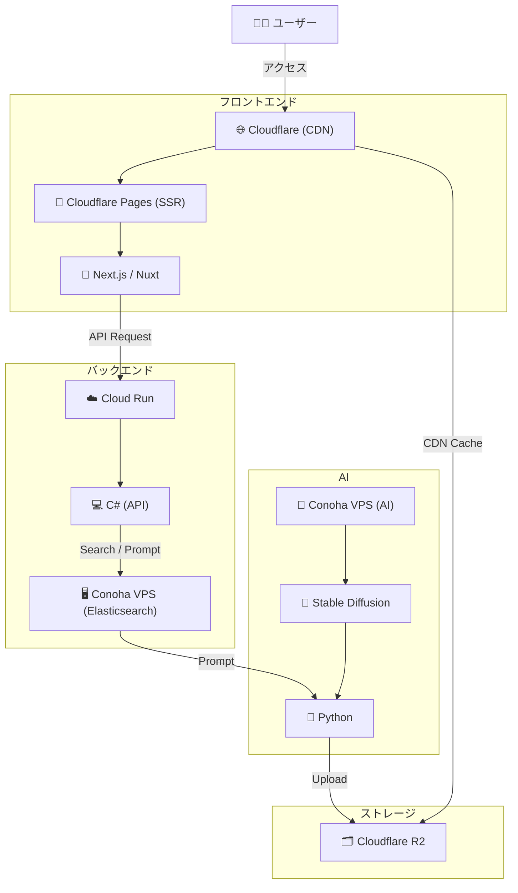

```mermaid
graph TD

  %% ==== User ====
  User["🧑‍💻 ユーザー"]
  User -->|アクセス| CF

  %% ==== Frontend ====
  subgraph フロントエンド
    CF["🌐 Cloudflare (CDN)"]
    Pages["📄 Cloudflare Pages (SSR)"]
    Framework["🧱 Next.js / Nuxt"]
    CF --> Pages
    Pages --> Framework
  end

  %% ==== Backend ====
  subgraph バックエンド
    CloudRun["☁️ Cloud Run"]
    CSharp["💻 C# (API)"]
    Framework -->|API Request| CloudRun
    CloudRun --> CSharp
    CSharp -->|"Search / Prompt"| ESNode
  end

  %% ==== Elasticsearch on VPS ====
  ESNode["🖥️ Conoha VPS (Elasticsearch)"]

  %% ==== Storage ====
  subgraph ストレージ
    R2["🗂️ Cloudflare R2"]
  end

  %% ==== AI ====
  subgraph AI
    ConohaAI["🧠 Conoha VPS (AI)"]
    SD["🎨 Stable Diffusion"]
    Python["🐍 Python"]
    ESNode -->|Prompt| Python
    ConohaAI --> SD
    SD --> Python
    Python -->|Upload| R2
  end

  %% CDN - R2 Cache
  CF -->|CDN Cache| R2
```
